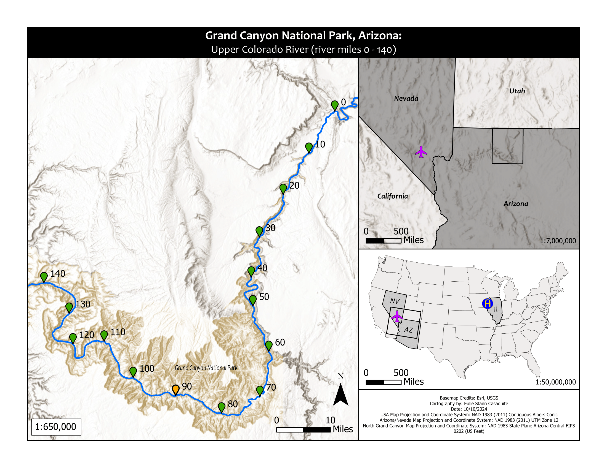

# 🌍 Projects Page

## 🏞️ Southeast Asia Hazard Map
**Description**: Visualizing geohazard risks across Southeast Asia.

## 🏞️ Southeast Asia Hazard Map
**Description**: Visualizing geohazard risks across Southeast Asia.

---
## 🌋 Geohazard Risk Mapping
**Description**: Developed a geospatial tool to calculate volcanic hazard exposure using Sentinel-2 imagery.

---

## 🏞️ Southeast Asia Hazard Map
**Description**: Visualizing geohazard risks across Southeast Asia.

---

## 🏜️ Grand Canyon Cartographic Design
**Description**: A topographic and geological map of the Grand Canyon.

---

## 🏜️ Grand Canyon Cartographic Design
**Description**: A topographic and geological map of the Grand Canyon.

---

## 🏜️ Grand Canyon Cartographic Design
**Description**: A topographic and geological map of the Grand Canyon.

---

## 🏜️ Grand Canyon Cartographic Design
**Description**: A topographic and geological map of the Grand Canyon.

